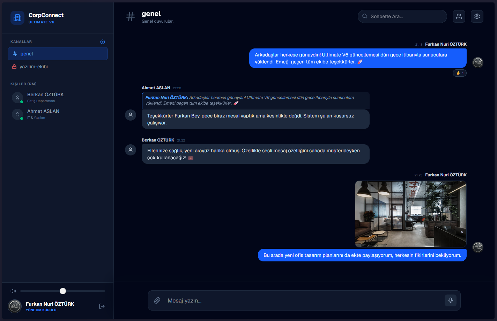
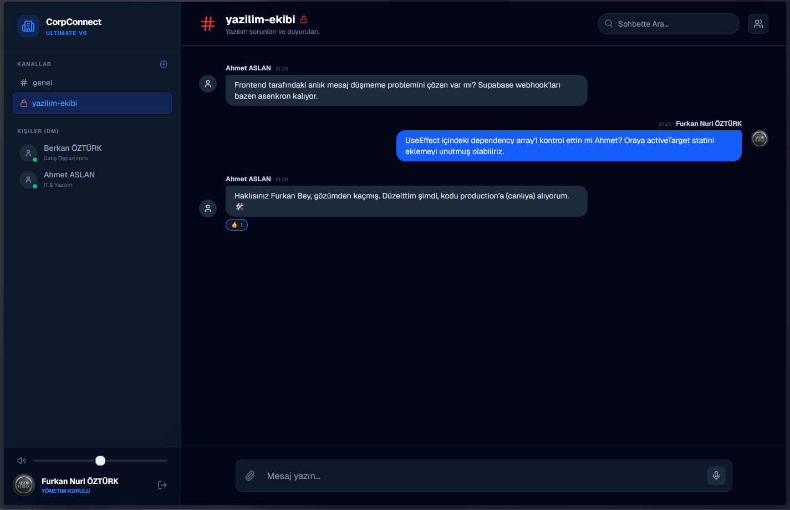

# 🏢 CorpConnect - Kurumsal İletişim Platformu

CorpConnect, şirket içi iletişimi tek bir noktadan, güvenli ve gerçek zamanlı olarak yönetmek için geliştirilmiş modern bir web uygulamasıdır. Slack ve Microsoft Teams'in en sevilen özelliklerini barındıran bu platform; ekiplerin kendi aralarında kanallar açmasını, özel mesajlaşmasını (DM) ve dosya/ses paylaşmasını sağlar.

Sisteme sadece önceden üretilmiş ve departmanı belirlenmiş "Özel Davet Kodları" ile kayıt olunabilir. Dışarıdan hiç kimse sisteme sızamaz.

---

## 🚀 Öne Çıkan Özellikler (Ultimate V6)

* **Gerçek Zamanlı İletişim (Realtime):** Supabase WebSocket altyapısı ile mesajlar anında ekrana düşer. Sayfa yenilemeye gerek yoktur.
* **Gelişmiş Kanal Yönetimi:** Herkes kendi kanalını oluşturabilir. Kanallar "Genel" veya sadece belirli departman/kişilere açık "Gizli" olarak ayarlanabilir. Kurucular kanala "Moderatör" atayabilir.
* **Özel Mesajlar (DM) ve Okundu Bilgisi:** Kişiler arası özel mesajlaşma, okunmamış mesaj bildirimleri (kırmızı rozet) ve mavi tik (okundu/iletildi) sistemi.
* **Yazıyor... Animasyonu & Sesli Bildirim:** Karşı taraf klavyeye dokunduğunda anlık olarak yazıyor animasyonu çıkar ve mesaj geldiğinde "Ding" sesi çalar.
* **Sesli Mesaj (Voice Notes) & Medya Paylaşımı:** Sadece yazıyla kalmayın; tek tuşla sesinizi kaydedip gönderin veya resim/dosya yükleyin.
* **Mesaj Alıntılama & Emoji Tepkileri:** WhatsApp tarzı mesaj yanıtlama ve Slack tarzı mesajlara emoji (👍, ❤️) bırakabilme.
* **Sohbet İçi Arama:** Binlerce mesajın içinde saniyesinde kelime araması yapın.
* **Canlı Online Radarı:** Sisteme o an bağlı olan kişilerin profilinde anında yeşil nokta yanar.

---

## 💻 Kullanılan Teknolojiler

* **Frontend:** React, Next.js (App Router), Tailwind CSS
* **Backend & Database:** Supabase (PostgreSQL, Auth, Storage, Realtime)
* **İkonlar:** Lucide React

---

## 🛠️ Adım Adım Kurulum Rehberi (En Basit Anlatımla)

Bu projeyi kendi bilgisayarınızda çalıştırmak çok kolaydır. Aşağıdaki adımları sırasıyla takip edin.

### 1. Projeyi Bilgisayarınıza İndirin
Terminalinizi (Komut İstemi) açın ve şu komutları yazın:

git clone [https://github.com/Aisohfurkan/corpconnect.git](https://github.com/Aisohfurkan/corpconnect.git)
cd corpconnect
npm install

2. Supabase (Veritabanı) Kurulumu

Bu projenin beyni Supabase'dir. Tamamen ücretsiz bir hesap açarak veritabanını kuracağız.

    Supabase.com'a gidin ve yeni bir proje oluşturun.

    Proje oluştuktan sonra sol menüden SQL Editor bölümüne tıklayın.

    Aşağıdaki SQL kodunun tamamını kopyalayın, oradaki boş alana yapıştırın ve RUN (Çalıştır) butonuna basın. Bu kod tüm tabloları ve ayarları sizin yerinize yapacaktır:

    -- 1. PROFİLLER TABLOSU
CREATE TABLE profiles (
  id UUID REFERENCES auth.users ON DELETE CASCADE PRIMARY KEY,
  full_name TEXT,
  title TEXT,
  department TEXT DEFAULT 'Genel',
  avatar_url TEXT,
  last_seen TIMESTAMPTZ DEFAULT now()
);

-- 2. DAVET KODLARI TABLOSU
CREATE TABLE invite_keys (
  id UUID DEFAULT gen_random_uuid() PRIMARY KEY,
  key_code TEXT UNIQUE NOT NULL,
  title_name TEXT,
  department TEXT,
  is_used BOOLEAN DEFAULT false,
  created_at TIMESTAMPTZ DEFAULT now()
);

-- 3. KANALLAR TABLOSU
CREATE TABLE channels (
  id UUID DEFAULT gen_random_uuid() PRIMARY KEY,
  name TEXT UNIQUE NOT NULL,
  description TEXT,
  is_private BOOLEAN DEFAULT false,
  created_by UUID REFERENCES profiles(id),
  allowed_users UUID[] DEFAULT '{}',
  allowed_departments TEXT[] DEFAULT '{}',
  moderators UUID[] DEFAULT '{}',
  created_at TIMESTAMPTZ DEFAULT now()
);

-- 4. KANAL MESAJLARI TABLOSU
CREATE TABLE messages (
  id UUID DEFAULT gen_random_uuid() PRIMARY KEY,
  channel_id UUID REFERENCES channels(id) ON DELETE CASCADE,
  user_id UUID REFERENCES profiles(id) ON DELETE CASCADE,
  content TEXT,
  file_url TEXT,
  audio_url TEXT,
  reply_to_id UUID REFERENCES messages(id),
  reactions JSONB DEFAULT '[]'::jsonb,
  created_at TIMESTAMPTZ DEFAULT now()
);

-- 5. ÖZEL MESAJLAR (DM) TABLOSU
CREATE TABLE direct_messages (
  id UUID DEFAULT gen_random_uuid() PRIMARY KEY,
  sender_id UUID REFERENCES profiles(id) ON DELETE CASCADE,
  receiver_id UUID REFERENCES profiles(id) ON DELETE CASCADE,
  content TEXT,
  file_url TEXT,
  audio_url TEXT,
  reply_to_id UUID REFERENCES direct_messages(id),
  reactions JSONB DEFAULT '[]'::jsonb,
  is_read BOOLEAN DEFAULT false,
  created_at TIMESTAMPTZ DEFAULT now()
);

-- 6. İLK YÖNETİCİ KODUNU ÜRETELİM
INSERT INTO invite_keys (key_code, title_name, department) VALUES ('PATRON-101', 'CEO', 'Yönetim Kurulu');

-- 7. REALTIME (CANLI YAYIN) İZİNLERİNİ AÇALIM
ALTER PUBLICATION supabase_realtime ADD TABLE messages, direct_messages, channels, profiles;

-- 8. STORAGE (DOSYA DEPOLAMA) BUCKET OLUŞTURMA
INSERT INTO storage.buckets (id, name, public) VALUES ('avatars', 'avatars', true);
INSERT INTO storage.buckets (id, name, public) VALUES ('chat-attachments', 'chat-attachments', true);

3. Storage (Depolama) İzinlerini Açma

Profil fotoğrafları ve gönderilen dosyaların yüklenebilmesi için klasörlere izin vermeliyiz.

    Supabase sol menüden Storage > Policies sekmesine gidin.

    avatars ve chat-attachments klasörleri için "New Policy" diyerek herkese açık Okuma (Select) ve Yükleme (Insert) yetkisi verin. (Test ortamı için hepsine izin verebilirsiniz).

4. Çevresel Değişkenleri (.env.local) Ayarlama

Uygulamanın veritabanınızla konuşabilmesi için anahtarlara ihtiyacı var.

    İndirdiğiniz proje klasörünün ana dizininde .env.local adında yeni bir dosya oluşturun.

    Supabase panelinizde Project Settings > API kısmına gidin.

    Oradaki URL ve ANON KEY değerlerini kopyalayıp dosyanın içine şu şekilde yapıştırın:

    NEXT_PUBLIC_SUPABASE_URL=senin_supabase_url_adresin
    NEXT_PUBLIC_SUPABASE_ANON_KEY=senin_supabase_anon_key_degerin

5. Uygulamayı Başlatın! 🎉

Her şey hazır. Terminalinize dönün ve projeyi ayağa kaldırın:
    npm run dev

Tarayıcınızda http://localhost:3000 adresine gidin. Kayıt olma ekranında az önce veritabanına eklediğimiz PATRON-101 davet kodunu kullanarak ilk kurucu (CEO) hesabınızı açın ve sistemin tadını çıkarın!
